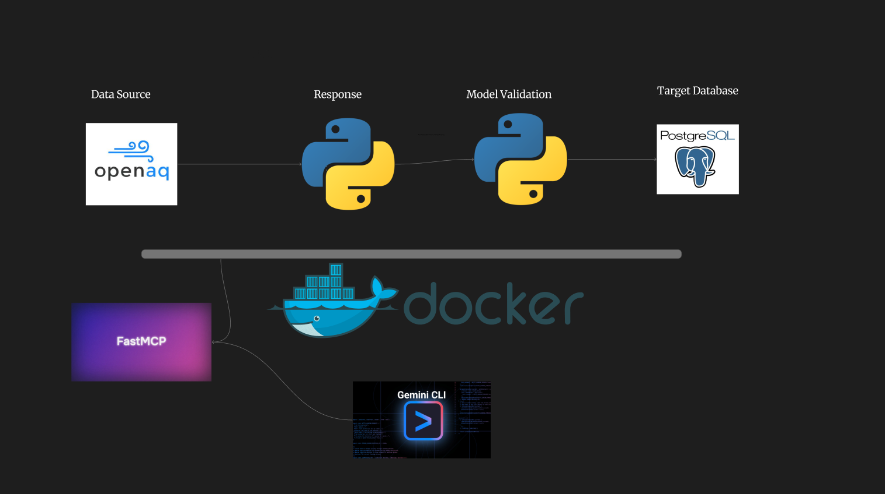

# OpenAQ Pipeline

An end-to-end data pipeline for fetching, validating, and storing air quality data from the OpenAQ platform.



## Overview

This project provides a complete data pipeline that collects air quality measurements from the OpenAQ REST API, validates the data using Pydantic models, and stores it in a PostgreSQL database. The pipeline includes data lineage tracking and visualization capabilities..

<p align="center">
  
</p>

## Features

- **Data Collection**: Fetch air quality data from OpenAQ REST API
- **Data Validation**: Validate incoming data using Pydantic models
- **Data Storage**: Store validated data in PostgreSQL database
- **Data Lineage**: Track data flow through the pipeline
- **MCP Server**: Control pipeline operations via Model Context Protocol
- **Visualization**: View data lineage with interactive web interface
- **Docker Support**: Fully containerized deployment

## Tech Stack

- **Python 3.9+**: Core programming language
- **Pydantic**: Data validation and modeling
- **PostgreSQL**: Database for storing measurements
- **Loguru**: Logging and monitoring
- **FastMCP**: MCP server implementation
- **Docker**: Containerization and deployment
- **Pytest**: Testing framework

## Project Structure

```
openaq-pipeline/
├── parser/              # Main data processing module
│   ├── main.py         # Pipeline entry point
│   ├── response_openaq.py    # API client
│   ├── validation_json.py    # Pydantic models
│   ├── transform.py    # Data transformation
│   ├── send_to_postgres.py   # Database operations
│   └── leanage_logger.py     # Lineage tracking
├── mcp/                # MCP server for pipeline control
│   └── mcp_server.py   # FastMCP server implementation
├── pgdata/             # PostgreSQL initialization
├── datalineage/        # Data lineage visualization
├── tests/              # Test suite
└── docs/               # Documentation and images
```

## Quick Start

### Prerequisites

- Docker and Docker Compose
- Python 3.9 or higher (for local development)
- OpenAQ API key

### Installation

1. Clone the repository:
```bash
git clone https://github.com/yourusername/openaq-pipeline.git
cd openaq-pipeline
```

2. Create a `.env` file with your configuration:
```env
OPENAQ_API_KEY=your_api_key
POSTGRES_HOST=pgdata
POSTGRES_PORT=5432
POSTGRES_DB=openaq
POSTGRES_USER=postgres
POSTGRES_PASSWORD=your_password
SENSOR_ID=your_sensor_id
START_DATE=2025-01-01
START=0
STOP=30
STEP=1
```

3. Start the services:
```bash
make up
```

4. Initialize the database:
```bash
make init
```

5. Run the pipeline:
```bash
make main
```

## Usage

### Running the Pipeline

```bash
# Start all containers
make up

# Run the data pipeline
make main

# View logs
make logs

# Stop containers
make stop
```

### Running Tests

```bash
make test
```

### Data Lineage Visualization

```bash
# Start the lineage viewer
make run
```

Then open your browser to `http://localhost:5173`

## MCP Server

The project includes an MCP (Model Context Protocol) server that allows AI assistants to control the pipeline.

### Available Tools

- `command_start_all_containers`: Start all Docker containers
- `command_run_all_tests`: Run the test suite
- `permission_check`: Check permissions for operations

### Configuration

Configure the MCP server in `mcp/config.json` and set permissions in your `.env` file:

```env
PERMISSION_DOCKER_CONTROL=true
PERMISSION_POSTGRES_QUERY=true
PERMISSION_REQUESTS=true
```

## Development

### Install Dependencies

```bash
pip install -e ".[dev]"
```

### Code Quality

```bash
# Format code
black parser/ mcp/ tests/

# Lint code
ruff check parser/ mcp/ tests/

# Type checking
mypy parser/ mcp/
```

### Running Tests Locally

```bash
pytest tests/ -v
```

## Data Model

The pipeline processes air quality measurements with the following key parameters:

- **PM2.5, PM10**: Particulate matter
- **NO₂, O₃, CO, SO₂**: Gas pollutants
- **Timestamp**: UTC time
- **Location**: Sensor coordinates and metadata

## Contributing

Contributions are welcome! Please feel free to submit a Pull Request.

## License

MIT License

## Author

Rafael Alikhanli - rafaelalikhanli@gmail.com
